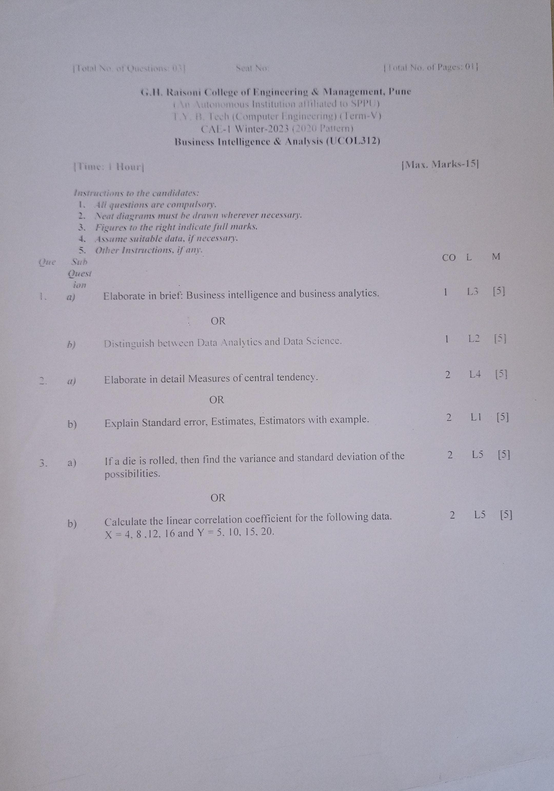
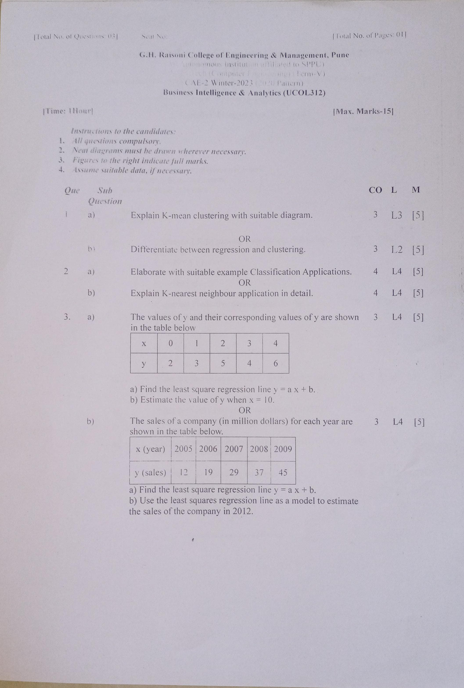

# Business Intelligence Analytics

## Syllabus

| Unit   | Topic                                            | Hours |
| ------ | ------------------------------------------------ | ----- |
| Unit I | Introduction                                     |   4   |
|        | - Buzzwords, Analysis vs. Analytics               |       |
|        | - Business Analytics                              |       |
|        | - Data Analytics and Data Science                 |       |
|        | - Adding BI and ML                                |       |
|        | - Info graphic                                    |       |
|        | - Data Analytics Life Cycle                        |       |
| Unit II | Descriptive and Inferential Statistics          |   6   |
|        | - Descriptive Statistics                           |       |
|        | - Population and Sample                            |       |
|        | - Types of Data                                   |       |
|        | - Measurement Levels                              |       |
|        | - Representation of categorical variables          |       |
|        | - Measures of Central Tendency (Mean, Median, Mode) |       |
|        | - Skewness                                       |       |
|        | - Variance                                       |       |
|        | - Standard Deviation                             |       |
|        | - Coefficient of Variation                       |       |
|        | - Covariance                                     |       |
|        | - Correlation                                    |       |
|        | - Inferential Statistics                           |       |
|        | - Distribution                                   |       |
|        | - Standard Error                                 |       |
|        | - Estimators and Estimates                       |       |
| Unit III | Regression                                      |   8   |
|        | - Linear Regression                               |       |
|        | - Introduction to Regression                      |       |
|        | - Simple and Multiple Linear Regression            |       |
|        | - Correlation vs. Regression                       |       |
|        | - SST (Sum of Squares Total)                      |       |
|        | - SSR (Sum of Squares Regression)                  |       |
|        | - SSE (Sum of Squares Error)                      |       |
|        | - R-Square Adjusted R-Squared                     |       |
|        | - Multiple Linear Regression                       |       |
|        | - Regression using Data Analysis toolbox of Excel  |       |
|        | - Significance of P-Value                         |       |
| Unit IV | Clustering and Classification                   |   8   |
|        | - Clustering                                      |       |
|        | - Introduction to clustering and classification     |       |
|        | - K-means clustering                             |       |
|        | - Clustering Categorical Data                    |       |
|        | - How to choose Number of Clusters                |       |
|        | - Pros and Cons of K-Means Clustering            |       |
|        | - Relationship between Clustering and Regression   |       |
|        | - Market Segmentation with Cluster Analysis      |       |
|        | - Classification                                 |       |
|        | - Introduction to Classification                   |       |
|        | - Classification Applications                      |       |
|        | - Logistic Regression                              |       |
|        | - Classification using SVM                         |       |
|        | - K-nearest neighbor                               |       |
|        | - Decision Trees                                  |       |
| Unit V | DBMS and BIRT                                    |   5   |
|        | - Introduction to databases                       |       |
|        | - Schema creation                                 |       |
|        | - Keys                                           |       |
|        | - Relation Creations                              |       |
|        | - Data Insertion                                 |       |
|        | - SELECT: Data Retrieval                          |       |
|        | - Drop and Truncate Relation                      |       |
|        | - Data Upload via CSV file                        |       |
|        | - Where clause                                   |       |
|        | - Order by Clause                                |       |
|        | - Aggregate functions                            |       |
|        | - Group by Clause                                |       |
|        | - And Or In Not In                              |       |
|        | - Between                                       |       |
|        | - Like Not Like                                 |       |
|        | - Distinct                                      |       |
|        | - Nested Queries                                |       |
|        | - Aggregate Functions                            |       |
|        | - Having Clause                                 |       |
|        | - Union Intersection                             |       |
|        | - Joins (Inner, Left, Right, Full Outer)        |       |
|        | - Business Performance Management Systems         |       |

## Question Banks with Answers

- [CAE-1](#)
- [CAE-2](./BIA-CAE-2-Question-Bank.md)

## Question Papers

### **CAE- 1**

### **CAE- 2**

