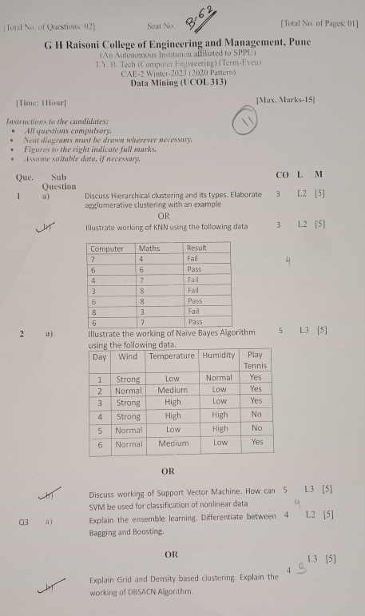

# Data Mining

## Syllabus

| Unit   | Topic                                                   | Hours |
| ------ | ------------------------------------------------------- | ----- |
| Unit I  | Introduction to data mining                           |   8   |
|         | - What is Data Mining?                                |       |
|         | - What is the Data Mining Process?                     |       |
|         | - Basic Data Mining Tasks                              |       |
|         | - Problem Identification                               |       |
|         | - Data Mining Metrics                                  |       |
|         | - Data Cleaning (pre-processing, feature selection,    |       |
|         |   data reduction, feature encoding, noise and         |       |
|         |   missing values, etc.)                               |       |
|         | - Key Issues                                          |       |
|         | - Opportunities for Data Mining                        |       |
| Unit II | Mining frequent patterns, associations and correlations |   8   |
|         | - Basic concepts                                       |       |
|         | - Efficient and scalable frequent itemset mining      |       |
|         |   algorithms                                           |       |
|         | - Mining various kinds of association rules           |       |
|         |   (multilevel and multidimensional)                   |       |
|         | - Association rule mining versus correlation analysis  |       |
|         | - Constraint-based association mining                  |       |
| Unit III | Classification and prediction                           |   8   |
|         | - Definition                                          |       |
|         | - Decision tree induction                             |       |
|         | - Bayesian classification                             |       |
|         | - Rule-based classification                           |       |
|         | - Classification by backpropagation and support vector |       |
|         |   machines                                            |       |
|         | - Associative classification                          |       |
|         | - Lazy learners                                       |       |
|         | - Prediction                                          |       |
|         | - Accuracy and error measures                         |       |
| Unit IV | Testing and Implementation                              |   8   |
|         | - Cluster analysis                                    |       |
|         | - Definition                                          |       |
|         | - Clustering algorithms (partitioning, hierarchical,   |       |
|         |   density-based, grid-based, and model-based)         |       |
|         | - Clustering high-dimensional data                     |       |
|         | - Constraint-based cluster analysis                    |       |
|         | - Outlier analysis (density-based and distance-based)  |       |
| Unit V  | Project Management                                     |   8   |
|         | - Data mining on complex data and applications         |       |
|         | - Algorithms for mining of spatial data, multimedia    |       |
|         |   data, text data                                     |       |
|         | - Data mining applications                             |       |
|         | - Social impacts of data mining                        |       |
|         | - Trends in data mining                               |       |

## Question Bank with Answers

- [CAE - 1]()
- [CAE - 2](DM-CAE-2-Question-Bank.md)
- [CAE - 3]()
- [ESE]()

## Question Papers with Answers

### **CAE- 1**

### **CAE- 2**

