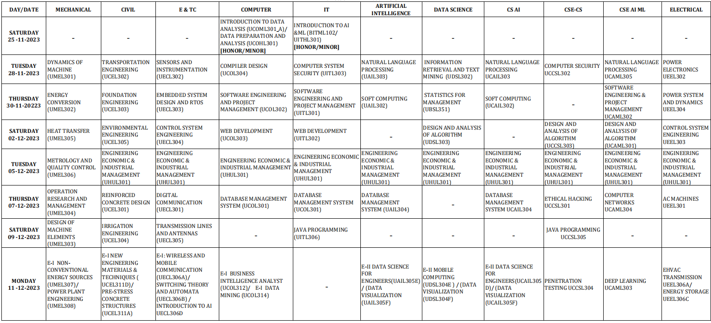

# Welcome to TYMaterials

Get Third Year Notes, Question Bank Solutions, etc for GHRCEM Pune. 

I'm from Computer Department so only Computer notes, if anyone is interested to share their notes feel free to contact [me](mailto:gautam.patil.cs@ghrcem.raisoni.net).

## Subjects

- [Software Engineering & Project Management](sepm/index.md)
- [Web Development](WD/index.md)
- [Database Management System](dbms/index.md)
- [Compiler Design](cd/index.md)
- [Engineering Economics & Industrial Management](eeim/index.md)

## End Sem Time Table

## About

This project is just a reference from multiple educational sites geared towards syllabus from GHRCEM.
The Website has Notes, Question Bank Solutions, Lab Manuals, Teacher's digital notes from Classroom, etc. The notes are created/extracted :skull: from sites such as geeksforgeeks, javatpoint, tutorialspoint, etc.

Created by [Gautam Patil](https://gautampatil.tech)

## More Projects

- [FYMaterials](https://fymaterials.live)
- [LofiPomo](https://lofipomo.gautampatil11.repl.co)
- [EBikeStore](https://ebikestore.gautampatil.tech)
- [ShortStories](https://short-stories-webapp.vercel.app/)
