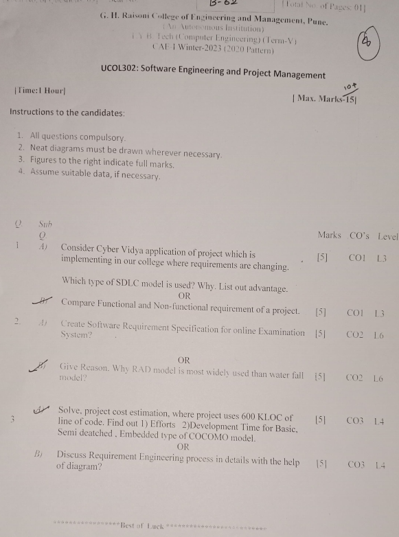
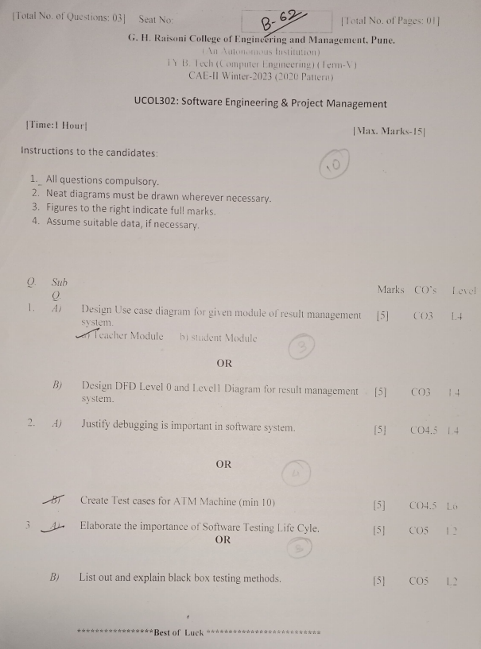

# Software Engineering & Project Management

## Syllabus

| Unit   | Topic                                               | Hours |
| ------ | --------------------------------------------------- | ----- |
| [Unit I](Unit1.md) | [INTRODUCTION TO SOFTWARE PROCESS](Unit1.md)                   | 8     |
|        | - Introduction to Software Engineering             |       |
|        | - Software Process                                  |       |
|        | - Perspective and Specialized Process Models       |       |
|        | - Software Project Management                       |       |
|        | - Estimation (LOC and FP Based Estimation)         |       |
|        | - COCOMO Model                                     |       |
|        | - Project Scheduling                                |       |
|        | - Earned Value Analysis                            |       |
|        | - Risk Management                                  |       |
| [Unit II](Unit2.md)| [REQUIREMENTS ANALYSIS AND SPECIFICATION](Unit2.md)             | 8     |
|        | - Software Requirements (Functional and Non-Functional) |       |
|        | - User requirements                                |       |
|        | - System requirements                              |       |
|        | - Software Requirements Document                    |       |
|        | - Requirement Engineering Process                   |       |
|        | - Feasibility Studies                              |       |
|        | - Requirements elicitation and analysis             |       |
|        | - Requirements validation                          |       |
|        | - Requirements management                          |       |
|        | - Classical analysis (Structured system Analysis, Petri Nets, Data Dictionary) | |
| [Unit III](Unit3.md)| [SOFTWARE DESIGN](Unit3.md)                                    | 8     |
|        | - Design process                                   |       |
|        | - Design Concepts                                  |       |
|        | - Design Model                                     |       |
|        | - Design Heuristic                                 |       |
|        | - Architectural Design                             |       |
|        | - Architectural styles                             |       |
|        | - Architectural Mapping using Data Flow            |       |
|        | - User Interface Design                            |       |
|        | - Component level Design (Class based components, traditional Components) | |
| [Unit IV](Unit4.md)| [TESTING AND IMPLEMENTATION](Unit4.md)                        | 8     |
|        | - Software testing fundamentals                    |       |
|        | - Internal and external views of Testing            |       |
|        | - White box testing (basis path testing, control structure testing) | |
|        | - Black box testing                                |       |
|        | - Regression Testing                               |       |
|        | - Unit Testing                                     |       |
|        | - Integration Testing                              |       |
|        | - Validation Testing                               |       |
|        | - System Testing and Debugging                     |       |
|        | - Software Implementation Techniques (Coding practices, Refactoring) | |
| [Unit V](Unit5.md)  | [PROJECT MANAGEMENT](Unit5.md)                                | 8     |
|        | - Estimation (FP Based, LOC Based)                 |       |
|        | - Make/Buy Decision                                |       |
|        | - COCOMO II Planning                               |       |
|        | - Project Plan                                     |       |
|        | - Planning Process                                 |       |
|        | - RFP Risk Management (Identification, Projection, RMMM) |       |
|        | - Scheduling and Tracking                          |       |
|        | - Relationship between people and effort            |       |
|        | - Task Set & Network                               |       |
|        | - EVA Process and Project Metrics                  |       |
|        | - Recent trends in software engineering (Agile methodology, scrum, pair programming) | |

## Question Bank with Answers
    Coming ASAP
- [CAE - 1](SEPM-CAE-1-Question-Bank.md)
- [CAE - 2](SEPM-CAE-2-Question-Bank.md)
- [CAE - 3]()
- [ESE]()

## Question Papers with Answers

### **CAE- 1**

### **CAE- 2**

## Lab Manual
<iframe src="https://drive.google.com/file/d/13cgDwylP5kqhsL3APiaNUIuhmENuBu8o/preview" width="800" height="480" allow="autoplay"></iframe>

